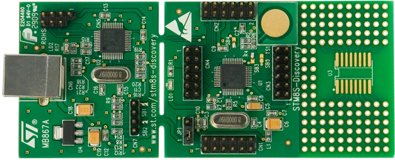

# Watch guro, yeah!
* Target Hardware: stm8s-discovery
* Purpose: hack stm8s105c6t6 mcu
* Host: Gentoo GNU/Linux
* Compiler: sdcc from
* Soft programmer: stm8flash from https://github.com/vdudouyt/stm8flash
* Debugging: ....
* Licence: Apache License Version 2.0 on ./project/, any licences to ./lib/

